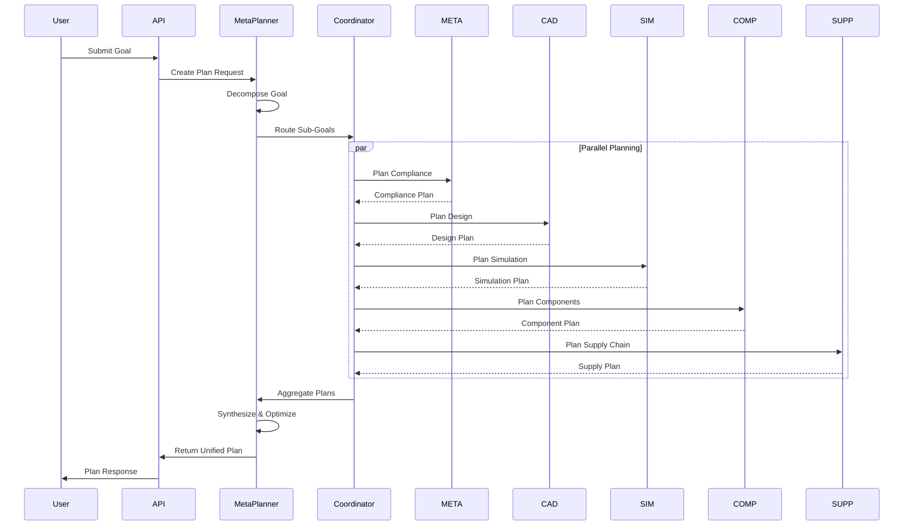
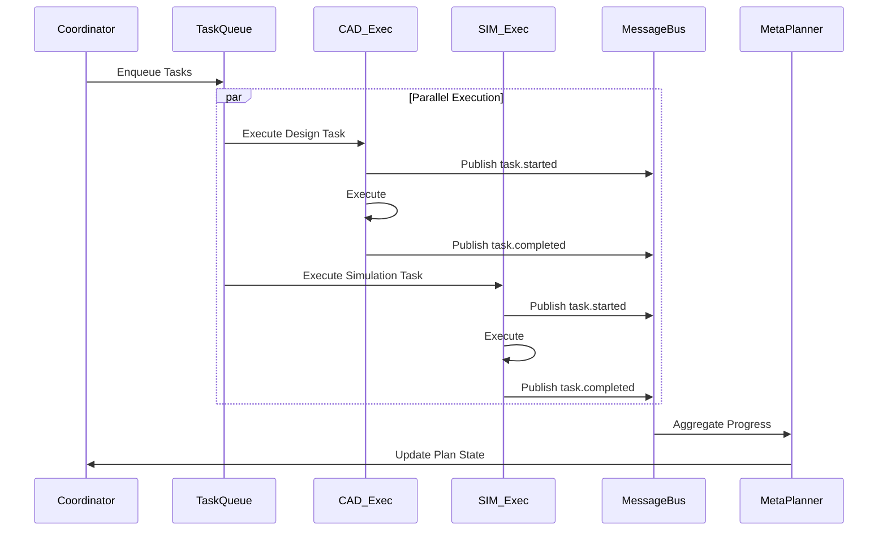
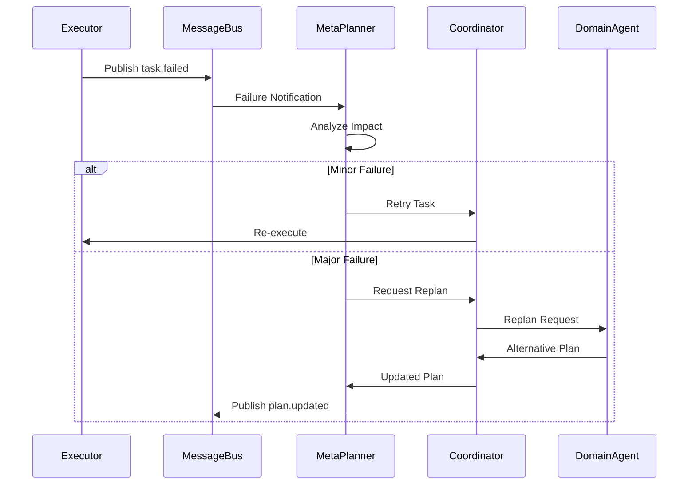

# Multi-Agent Architecture Design

## Overview

The Meta Planner system uses a **hierarchical multi-agent architecture** where specialized agents collaborate to decompose, plan, and execute complex workflows. This architecture enables parallel processing, domain expertise, and scalable task execution.

## Agent Hierarchy

### Level 1: Meta Planner Agent (Orchestrator)
**Role**: Top-level strategic planner and orchestrator

**Responsibilities**:
- Receive high-level goals from users via API
- Decompose goals into domain-specific sub-goals
- Identify cross-domain dependencies
- Coordinate domain planning agents
- Synthesize domain plans into unified execution plan
- Monitor overall execution progress
- Trigger replanning when needed

**Key Capabilities**:
- Strategic decomposition using LLM reasoning
- Cross-domain dependency analysis
- Plan synthesis and optimization
- Adaptive replanning

---

### Level 2: Agent Coordinator (Manager)
**Role**: Central coordination and communication hub

**Responsibilities**:
- Manage agent registry (registration, discovery, health)
- Route tasks to appropriate domain agents
- Manage message bus for inter-agent communication
- Handle agent failures and recovery
- Load balance across multiple agent instances
- Maintain shared state across agents

**Key Capabilities**:
- Dynamic agent discovery
- Intelligent task routing
- Fault tolerance and recovery
- State synchronization

---

### Level 3: Domain Planning Agents (Specialists)

#### 3.1 META Agent (Regulatory & Compliance)
**Domain**: High-level coordination, regulatory compliance, standards

**Responsibilities**:
- Validate regulatory requirements
- Ensure compliance with industry standards
- Coordinate cross-domain activities
- Risk assessment and mitigation planning

**Planning Strategies**:
- Compliance-first planning
- Risk-based prioritization
- Regulatory constraint propagation

#### 3.2 CAD Agent (Design & Modeling)
**Domain**: Computer-aided design, 3D modeling, design validation

**Responsibilities**:
- Plan design tasks and iterations
- Identify design dependencies
- Schedule design reviews
- Coordinate with simulation for validation

**Planning Strategies**:
- Iterative design planning
- Design-for-X considerations
- Concurrent engineering approach

#### 3.3 SIM Agent (Simulation & Analysis)
**Domain**: Simulation, analysis, validation, testing

**Responsibilities**:
- Plan simulation campaigns
- Identify analysis requirements
- Schedule validation activities
- Coordinate with CAD for design feedback

**Planning Strategies**:
- Test-driven planning
- Progressive validation approach
- Multi-fidelity simulation planning

#### 3.4 COMP Agent (Component Planning)
**Domain**: Component selection, BOM management, compliance

**Responsibilities**:
- Plan component sourcing
- Manage BOM evolution
- Ensure component compliance
- Coordinate with suppliers

**Planning Strategies**:
- Make-vs-buy analysis
- Component reuse optimization
- Compliance verification planning

#### 3.5 SUPP Agent (Supply Chain)
**Domain**: Supplier management, procurement, logistics

**Responsibilities**:
- Plan supplier engagement
- Schedule procurement activities
- Manage supply chain risks
- Coordinate delivery timelines

**Planning Strategies**:
- Just-in-time planning
- Multi-supplier strategies
- Risk-based supplier selection

---

### Level 4: Execution Agents (Workers)
**Role**: Execute tasks planned by domain agents

**Responsibilities**:
- Execute individual tasks
- Report progress and results
- Handle task-level errors
- Validate task completion

**Key Capabilities**:
- Task execution
- Result validation
- Error handling
- Progress reporting

---

## Communication Protocols

### 1. Request-Response (Synchronous)
**Use Case**: Planning requests, queries, immediate responses

**Flow**:
```
Meta Planner → Agent Coordinator → Domain Agent → Response
```

**Message Format**:
```json
{
  "message_id": "uuid",
  "type": "request",
  "sender": "meta_planner",
  "recipient": "cad_agent",
  "payload": {
    "action": "plan",
    "goal": "Design automotive component",
    "constraints": {...}
  },
  "timestamp": "2026-01-20T11:00:00Z"
}
```

### 2. Publish-Subscribe (Asynchronous)
**Use Case**: Status updates, events, notifications

**Topics**:
- `plan.created` - New plan created
- `task.started` - Task execution started
- `task.completed` - Task completed
- `task.failed` - Task failed
- `agent.status` - Agent status updates

**Flow**:
```
Agent → Message Bus → Subscribed Agents
```

### 3. Task Queue (Distributed)
**Use Case**: Task distribution, execution coordination

**Queue Types**:
- `planning_queue` - Planning tasks
- `execution_queue` - Execution tasks
- `priority_queue` - High-priority tasks
- `retry_queue` - Failed tasks for retry

**Flow**:
```
Domain Agent → Task Queue → Execution Agent → Result Queue
```

### 4. State Synchronization
**Use Case**: Shared state management

**State Types**:
- **Plan State**: Current plan, task graph, dependencies
- **Execution State**: Task status, progress, results
- **Agent State**: Agent availability, capabilities, load

**Mechanism**: Event sourcing with state snapshots

---

## Multi-Agent Workflows

### Workflow 1: Goal Decomposition & Planning



### Workflow 2: Plan Execution



### Workflow 3: Adaptive Replanning



---

## Agent Communication Patterns

### Pattern 1: Scatter-Gather
**Use Case**: Meta Planner distributes sub-goals to domain agents and gathers results

```python
# Meta Planner scatters planning requests
sub_goals = decompose_goal(goal)
futures = []
for sub_goal in sub_goals:
    agent = coordinator.route_to_agent(sub_goal)
    future = agent.plan_async(sub_goal)
    futures.append(future)

# Gather results
plans = await asyncio.gather(*futures)
unified_plan = synthesize_plans(plans)
```

### Pattern 2: Pipeline
**Use Case**: Sequential processing through multiple agents (META → CAD → SIM → COMP → SUPP)

```python
# Pipeline execution
result = await (
    meta_agent.plan(goal)
    .then(cad_agent.plan)
    .then(sim_agent.plan)
    .then(comp_agent.plan)
    .then(supp_agent.plan)
)
```

### Pattern 3: Broadcast
**Use Case**: Notify all agents of system-wide events

```python
# Broadcast event to all agents
message_bus.publish("system.shutdown", {
    "reason": "maintenance",
    "timestamp": datetime.now()
})
```

---

## Coordination Mechanisms

### 1. Agent Registry
**Purpose**: Track all active agents and their capabilities

**Data Structure**:
```python
{
    "agent_id": "cad_agent_001",
    "type": "CAD",
    "capabilities": ["design", "modeling", "validation"],
    "status": "active",
    "load": 0.65,
    "last_heartbeat": "2026-01-20T11:00:00Z"
}
```

### 2. Task Routing
**Purpose**: Route tasks to appropriate agents

**Routing Strategies**:
- **Capability-based**: Match task requirements to agent capabilities
- **Load-based**: Route to least loaded agent
- **Affinity-based**: Route related tasks to same agent
- **Round-robin**: Distribute evenly across agents

### 3. Failure Recovery
**Purpose**: Handle agent failures gracefully

**Recovery Strategies**:
- **Task Retry**: Retry failed tasks with exponential backoff
- **Agent Restart**: Restart failed agents automatically
- **Task Reassignment**: Reassign tasks from failed agents
- **Degraded Mode**: Continue with reduced capabilities

### 4. State Synchronization
**Purpose**: Maintain consistent state across agents

**Synchronization Mechanisms**:
- **Event Sourcing**: Append-only event log
- **State Snapshots**: Periodic state checkpoints
- **Conflict Resolution**: Last-write-wins or custom logic

---

## Scalability Considerations

### Horizontal Scaling
- **Multiple Agent Instances**: Run multiple instances of each domain agent
- **Load Balancing**: Distribute tasks across instances
- **Stateless Agents**: Design agents to be stateless for easy scaling

### Vertical Scaling
- **Resource Allocation**: Allocate more resources to bottleneck agents
- **Parallel Processing**: Process multiple tasks concurrently within agent

### Performance Optimization
- **Caching**: Cache frequently used data and plans
- **Batching**: Batch similar tasks for efficiency
- **Async Processing**: Use async/await for I/O-bound operations

---

## Security & Isolation

### Agent Isolation
- Each agent runs in isolated environment
- Limited access to shared resources
- Sandboxed execution for safety

### Authentication & Authorization
- Agent-to-agent authentication via tokens
- Role-based access control (RBAC)
- Audit logging for all agent actions

### Data Privacy
- Encrypt inter-agent communication
- Secure storage of sensitive data
- Data access controls per agent

---

## Monitoring & Observability

### Metrics
- **Agent Metrics**: CPU, memory, task count, success rate
- **Coordination Metrics**: Message throughput, routing latency
- **System Metrics**: Overall throughput, end-to-end latency

### Logging
- **Structured Logging**: JSON-formatted logs
- **Distributed Tracing**: Trace requests across agents
- **Correlation IDs**: Track related events

### Alerting
- **Agent Health**: Alert on agent failures
- **Performance**: Alert on degraded performance
- **Resource Usage**: Alert on resource exhaustion

---

## API Specifications

This section details all REST APIs required for the multi-agent meta-planning system, organized by functional area and implementation stage.

### API Architecture

**Base URL**: `http://localhost:8000/api/v1`

**Authentication**: Bearer token (JWT)

**Response Format**: JSON

**Error Handling**: Standard HTTP status codes with detailed error messages

---

## Stage 1: Core Planning APIs

### 1.1 Goal & Plan Management

#### `POST /plans/create`
Create a new plan from a high-level goal.

**Request**:
```json
{
  "goal": {
    "title": "Design and validate automotive component",
    "description": "Create a new brake caliper design with simulation validation",
    "domain": "automotive",
    "constraints": {
      "timeline": "30 days",
      "budget": 100000,
      "compliance": ["ISO 26262", "IATF 16949"]
    },
    "priority": "high"
  },
  "options": {
    "auto_execute": false,
    "enable_replanning": true,
    "parallelization": "aggressive"
  }
}
```

**Response**:
```json
{
  "plan_id": "plan_abc123",
  "status": "planning",
  "created_at": "2026-01-20T11:30:00Z",
  "estimated_completion": "2026-02-19T11:30:00Z",
  "task_count": 45,
  "agents_assigned": ["META", "CAD", "SIM", "COMP", "SUPP"],
  "message": "Plan created successfully. Decomposing goal across domain agents."
}
```

#### `GET /plans/{plan_id}`
Get detailed plan information.

**Response**:
```json
{
  "plan_id": "plan_abc123",
  "goal": {...},
  "status": "ready",
  "created_at": "2026-01-20T11:30:00Z",
  "updated_at": "2026-01-20T11:32:00Z",
  "task_graph": {
    "nodes": [
      {
        "task_id": "task_001",
        "name": "Regulatory compliance check",
        "agent": "META",
        "status": "pending",
        "dependencies": [],
        "estimated_duration": "2 hours"
      },
      {
        "task_id": "task_002",
        "name": "Initial CAD design",
        "agent": "CAD",
        "status": "pending",
        "dependencies": ["task_001"],
        "estimated_duration": "8 hours"
      }
    ],
    "edges": [
      {"from": "task_001", "to": "task_002", "type": "sequential"}
    ]
  },
  "metrics": {
    "total_tasks": 45,
    "critical_path_length": 12,
    "parallelization_ratio": 0.73,
    "estimated_makespan": "18 days"
  }
}
```

#### `GET /plans/{plan_id}/graph`
Get dependency graph visualization data.

**Response**:
```json
{
  "plan_id": "plan_abc123",
  "graph": {
    "format": "dagre",
    "nodes": [...],
    "edges": [...],
    "critical_path": ["task_001", "task_002", "task_015", "task_030"]
  },
  "visualization_url": "/visualizations/plan_abc123.svg"
}
```

#### `GET /plans/{plan_id}/schedule`
Get optimized execution schedule.

**Response**:
```json
{
  "plan_id": "plan_abc123",
  "schedule": {
    "algorithm": "critical_path_method",
    "makespan": "18 days",
    "time_slots": [
      {
        "start_time": "2026-01-20T12:00:00Z",
        "end_time": "2026-01-20T14:00:00Z",
        "tasks": ["task_001"],
        "agents": ["META"]
      },
      {
        "start_time": "2026-01-20T14:00:00Z",
        "end_time": "2026-01-20T22:00:00Z",
        "tasks": ["task_002", "task_003", "task_004"],
        "agents": ["CAD", "SIM", "COMP"]
      }
    ],
    "resource_utilization": {
      "META": 0.45,
      "CAD": 0.82,
      "SIM": 0.67,
      "COMP": 0.55,
      "SUPP": 0.38
    }
  }
}
```

#### `POST /plans/{plan_id}/replan`
Trigger adaptive replanning.

**Request**:
```json
{
  "reason": "task_failure",
  "failed_task_id": "task_015",
  "constraints": {
    "preserve_completed": true,
    "max_delay": "2 days"
  }
}
```

**Response**:
```json
{
  "plan_id": "plan_abc123",
  "replan_id": "replan_xyz789",
  "status": "replanning",
  "changes": {
    "tasks_added": 3,
    "tasks_removed": 1,
    "tasks_modified": 5
  },
  "estimated_impact": {
    "delay": "1.5 days",
    "cost_increase": 5000
  }
}
```

#### `DELETE /plans/{plan_id}`
Cancel/delete a plan.

**Response**:
```json
{
  "plan_id": "plan_abc123",
  "status": "cancelled",
  "message": "Plan cancelled successfully"
}
```

---

## Stage 2: Execution APIs

### 2.1 Execution Management

#### `POST /executions/start`
Start plan execution.

**Request**:
```json
{
  "plan_id": "plan_abc123",
  "execution_mode": "parallel",
  "options": {
    "dry_run": false,
    "checkpoint_interval": "1 hour",
    "failure_strategy": "replan"
  }
}
```

**Response**:
```json
{
  "execution_id": "exec_def456",
  "plan_id": "plan_abc123",
  "status": "running",
  "started_at": "2026-01-20T12:00:00Z",
  "websocket_url": "ws://localhost:8000/ws/executions/exec_def456"
}
```

#### `GET /executions/{execution_id}`
Get execution status.

**Response**:
```json
{
  "execution_id": "exec_def456",
  "plan_id": "plan_abc123",
  "status": "running",
  "started_at": "2026-01-20T12:00:00Z",
  "progress": {
    "completed_tasks": 12,
    "total_tasks": 45,
    "percentage": 26.7,
    "current_tasks": [
      {
        "task_id": "task_013",
        "agent": "CAD",
        "status": "running",
        "progress": 0.65
      }
    ]
  },
  "metrics": {
    "elapsed_time": "4 hours",
    "estimated_remaining": "14 hours",
    "throughput": "3 tasks/hour"
  }
}
```

#### `POST /executions/{execution_id}/pause`
Pause execution.

**Response**:
```json
{
  "execution_id": "exec_def456",
  "status": "paused",
  "paused_at": "2026-01-20T16:00:00Z",
  "checkpoint_id": "checkpoint_001"
}
```

#### `POST /executions/{execution_id}/resume`
Resume paused execution.

**Response**:
```json
{
  "execution_id": "exec_def456",
  "status": "running",
  "resumed_at": "2026-01-20T16:30:00Z",
  "resumed_from": "checkpoint_001"
}
```

#### `POST /executions/{execution_id}/cancel`
Cancel execution.

**Response**:
```json
{
  "execution_id": "exec_def456",
  "status": "cancelled",
  "cancelled_at": "2026-01-20T17:00:00Z",
  "completed_tasks": 18,
  "rollback_available": true
}
```

#### `GET /executions/{execution_id}/logs`
Get execution logs.

**Query Parameters**:
- `level`: `debug`, `info`, `warning`, `error`
- `agent`: Filter by agent ID
- `task`: Filter by task ID
- `limit`: Number of log entries (default: 100)
- `offset`: Pagination offset

**Response**:
```json
{
  "execution_id": "exec_def456",
  "logs": [
    {
      "timestamp": "2026-01-20T12:05:00Z",
      "level": "info",
      "agent": "CAD",
      "task_id": "task_002",
      "message": "Starting CAD design task",
      "metadata": {...}
    }
  ],
  "total": 1523,
  "limit": 100,
  "offset": 0
}
```

#### `GET /executions/{execution_id}/metrics`
Get detailed execution metrics.

**Response**:
```json
{
  "execution_id": "exec_def456",
  "metrics": {
    "performance": {
      "total_time": "4 hours",
      "planning_time": "2 minutes",
      "execution_time": "3 hours 58 minutes",
      "throughput": "3 tasks/hour",
      "parallelization_achieved": 0.71
    },
    "resource_utilization": {
      "META": {"avg": 0.45, "peak": 0.78},
      "CAD": {"avg": 0.82, "peak": 0.95},
      "SIM": {"avg": 0.67, "peak": 0.88}
    },
    "quality": {
      "task_success_rate": 0.94,
      "replanning_count": 2,
      "retry_count": 5
    }
  }
}
```

---

## Stage 3: Agent Management APIs

### 3.1 Agent Registry & Discovery

#### `POST /agents/register`
Register a new agent.

**Request**:
```json
{
  "agent_type": "CAD",
  "agent_id": "cad_agent_002",
  "capabilities": ["design", "modeling", "validation"],
  "capacity": {
    "max_concurrent_tasks": 5,
    "max_queue_size": 20
  },
  "metadata": {
    "version": "1.0.0",
    "llm_model": "gpt-4"
  }
}
```

**Response**:
```json
{
  "agent_id": "cad_agent_002",
  "status": "registered",
  "registered_at": "2026-01-20T11:00:00Z",
  "token": "agent_token_xyz..."
}
```

#### `GET /agents`
List all registered agents.

**Query Parameters**:
- `type`: Filter by agent type
- `status`: Filter by status (`active`, `inactive`, `failed`)

**Response**:
```json
{
  "agents": [
    {
      "agent_id": "meta_planner_001",
      "type": "META_PLANNER",
      "status": "active",
      "load": 0.35,
      "tasks_completed": 156,
      "uptime": "72 hours",
      "last_heartbeat": "2026-01-20T11:29:00Z"
    },
    {
      "agent_id": "cad_agent_001",
      "type": "CAD",
      "status": "active",
      "load": 0.82,
      "tasks_completed": 89,
      "uptime": "48 hours",
      "last_heartbeat": "2026-01-20T11:29:00Z"
    }
  ],
  "total": 12
}
```

#### `GET /agents/{agent_id}`
Get agent details.

**Response**:
```json
{
  "agent_id": "cad_agent_001",
  "type": "CAD",
  "status": "active",
  "capabilities": ["design", "modeling", "validation"],
  "current_load": 0.82,
  "capacity": {
    "max_concurrent_tasks": 5,
    "current_tasks": 4,
    "queued_tasks": 8
  },
  "statistics": {
    "tasks_completed": 89,
    "tasks_failed": 3,
    "success_rate": 0.967,
    "avg_task_duration": "2.5 hours"
  },
  "health": {
    "status": "healthy",
    "cpu_usage": 0.65,
    "memory_usage": 0.48,
    "last_heartbeat": "2026-01-20T11:29:00Z"
  }
}
```

#### `POST /agents/{agent_id}/invoke`
Directly invoke an agent action.

**Request**:
```json
{
  "action": "plan",
  "payload": {
    "goal": "Design brake caliper",
    "constraints": {...}
  }
}
```

**Response**:
```json
{
  "agent_id": "cad_agent_001",
  "action": "plan",
  "status": "completed",
  "result": {
    "plan": {...},
    "estimated_duration": "8 hours"
  },
  "execution_time": "1.2 seconds"
}
```

#### `DELETE /agents/{agent_id}`
Deregister an agent.

**Response**:
```json
{
  "agent_id": "cad_agent_002",
  "status": "deregistered",
  "message": "Agent deregistered successfully"
}
```

---

## Stage 4: Coordination & Communication APIs

### 4.1 Message Bus

#### `POST /messages/publish`
Publish a message to the message bus.

**Request**:
```json
{
  "topic": "task.completed",
  "payload": {
    "task_id": "task_002",
    "agent_id": "cad_agent_001",
    "result": {...}
  },
  "priority": "normal"
}
```

**Response**:
```json
{
  "message_id": "msg_abc123",
  "topic": "task.completed",
  "published_at": "2026-01-20T12:30:00Z",
  "subscribers_notified": 3
}
```

#### `POST /messages/subscribe`
Subscribe to message topics.

**Request**:
```json
{
  "agent_id": "sim_agent_001",
  "topics": ["task.completed", "plan.updated"],
  "filters": {
    "agent_type": "CAD"
  }
}
```

**Response**:
```json
{
  "subscription_id": "sub_xyz789",
  "agent_id": "sim_agent_001",
  "topics": ["task.completed", "plan.updated"],
  "created_at": "2026-01-20T12:00:00Z"
}
```

#### `DELETE /messages/subscribe/{subscription_id}`
Unsubscribe from topics.

**Response**:
```json
{
  "subscription_id": "sub_xyz789",
  "status": "unsubscribed"
}
```

### 4.2 Task Queue

#### `POST /queue/enqueue`
Add task to execution queue.

**Request**:
```json
{
  "task_id": "task_015",
  "agent_type": "SIM",
  "priority": "high",
  "payload": {...}
}
```

**Response**:
```json
{
  "queue_id": "queue_item_001",
  "task_id": "task_015",
  "position": 3,
  "estimated_wait": "15 minutes"
}
```

#### `GET /queue/status`
Get queue status.

**Response**:
```json
{
  "queues": [
    {
      "agent_type": "CAD",
      "pending_tasks": 8,
      "processing_tasks": 4,
      "avg_wait_time": "12 minutes"
    },
    {
      "agent_type": "SIM",
      "pending_tasks": 5,
      "processing_tasks": 3,
      "avg_wait_time": "8 minutes"
    }
  ]
}
```

---

## Stage 5: Monitoring & Analytics APIs

### 5.1 System Monitoring

#### `GET /status`
System health check.

**Response**:
```json
{
  "status": "healthy",
  "version": "1.0.0",
  "uptime": "72 hours",
  "components": {
    "api": "healthy",
    "database": "healthy",
    "message_bus": "healthy",
    "agent_coordinator": "healthy"
  },
  "active_agents": 12,
  "active_executions": 3
}
```

#### `GET /metrics`
System-wide metrics.

**Response**:
```json
{
  "timestamp": "2026-01-20T11:30:00Z",
  "system": {
    "total_plans": 156,
    "active_executions": 3,
    "completed_executions": 142,
    "failed_executions": 11,
    "success_rate": 0.928
  },
  "agents": {
    "total_registered": 12,
    "active": 11,
    "avg_utilization": 0.62
  },
  "performance": {
    "avg_planning_time": "1.8 minutes",
    "avg_execution_time": "12.5 hours",
    "throughput": "2.5 plans/day"
  }
}
```

#### `GET /metrics/agents/{agent_type}`
Agent-specific metrics.

**Response**:
```json
{
  "agent_type": "CAD",
  "instances": 3,
  "metrics": {
    "total_tasks": 267,
    "completed_tasks": 254,
    "failed_tasks": 13,
    "success_rate": 0.951,
    "avg_task_duration": "2.3 hours",
    "avg_utilization": 0.78
  }
}
```

### 5.2 Analytics

#### `GET /analytics/plans`
Plan analytics.

**Query Parameters**:
- `start_date`: Start date for analysis
- `end_date`: End date for analysis
- `domain`: Filter by domain

**Response**:
```json
{
  "period": {
    "start": "2026-01-01T00:00:00Z",
    "end": "2026-01-20T23:59:59Z"
  },
  "analytics": {
    "total_plans": 156,
    "avg_complexity": 42.5,
    "avg_makespan": "15.2 days",
    "parallelization_ratio": 0.68,
    "domains": {
      "automotive": 89,
      "aerospace": 45,
      "consumer": 22
    }
  }
}
```

#### `GET /analytics/benchmarks`
Benchmark results.

**Response**:
```json
{
  "benchmarks": [
    {
      "scenario": "simple",
      "runs": 50,
      "avg_planning_time": "0.5 seconds",
      "avg_execution_time": "2.3 hours",
      "success_rate": 0.98
    },
    {
      "scenario": "complex",
      "runs": 20,
      "avg_planning_time": "4.2 seconds",
      "avg_execution_time": "18.5 hours",
      "success_rate": 0.85
    }
  ]
}
```

---

## Stage 6: WebSocket APIs

### 6.1 Real-time Updates

#### `WS /ws/executions/{execution_id}`
Real-time execution updates.

**Connection**: WebSocket

**Messages Received**:
```json
{
  "type": "task.started",
  "execution_id": "exec_def456",
  "task_id": "task_015",
  "agent": "SIM",
  "timestamp": "2026-01-20T14:00:00Z"
}
```

```json
{
  "type": "task.progress",
  "execution_id": "exec_def456",
  "task_id": "task_015",
  "progress": 0.45,
  "timestamp": "2026-01-20T14:30:00Z"
}
```

```json
{
  "type": "task.completed",
  "execution_id": "exec_def456",
  "task_id": "task_015",
  "result": {...},
  "timestamp": "2026-01-20T15:00:00Z"
}
```

#### `WS /ws/agents`
Real-time agent status updates.

**Messages Received**:
```json
{
  "type": "agent.registered",
  "agent_id": "cad_agent_003",
  "timestamp": "2026-01-20T12:00:00Z"
}
```

```json
{
  "type": "agent.status",
  "agent_id": "cad_agent_001",
  "status": "active",
  "load": 0.82,
  "timestamp": "2026-01-20T12:05:00Z"
}
```

---

## Implementation Stages Summary

### **Stage 1: Core Planning** (Week 1-2)
- `POST /plans/create`
- `GET /plans/{plan_id}`
- `GET /plans/{plan_id}/graph`
- `GET /plans/{plan_id}/schedule`

### **Stage 2: Execution** (Week 3-4)
- `POST /executions/start`
- `GET /executions/{execution_id}`
- `POST /executions/{execution_id}/pause`
- `POST /executions/{execution_id}/resume`
- `GET /executions/{execution_id}/logs`

### **Stage 3: Agent Management** (Week 5)
- `POST /agents/register`
- `GET /agents`
- `GET /agents/{agent_id}`
- `POST /agents/{agent_id}/invoke`

### **Stage 4: Coordination** (Week 6)
- Message Bus APIs
- Task Queue APIs
- State Management

### **Stage 5: Monitoring** (Week 7)
- `GET /status`
- `GET /metrics`
- Analytics APIs

### **Stage 6: Real-time** (Week 8)
- WebSocket connections
- Real-time updates
- Event streaming

