# Meta Planning & Parallel Domain Decomposition

## 📖 Table of Contents

1. [Overview](#overview)
2. [Core Concepts](#core-concepts)
3. [Architecture](#architecture)
4. [Domain Agents](#domain-agents)
5. [Complete Workflow](#complete-workflow)
6. [Implementation Details](#implementation-details)
7. [Key Benefits](#key-benefits)

---

## Overview

### What is Meta Planning?

**Meta Planning** is a hierarchical planning approach where a high-level **Meta Planner** orchestrates multiple specialized **Domain Agents** to decompose complex goals into executable task graphs. Instead of a single monolithic agent trying to solve everything, the system distributes planning responsibilities across domain experts.

### What is Parallel Domain Decomposition?

**Parallel Domain Decomposition** means breaking down a complex problem into multiple independent domains (META, CAD, SIM, COMP, SUPP), where each domain has its own specialized agents that work in parallel to generate domain-specific tasks. These tasks are then merged into a unified dependency-aware task graph.

### The Big Picture

```
User Goal → Meta Planner → Domain Agents (Parallel) → Task Graph → Execution → Results
```

---

## Core Concepts

### 1. **Hierarchical Agent Architecture**

The system uses a **3-level hierarchy**:

```
Level 1: Meta Planner (Orchestrator)
    ↓
Level 2: Agent Coordinator (Manager)
    ↓
Level 3: Domain Agents (Specialists)
    ↓ (each domain has multiple sub-agents)
Level 4: Specialized Sub-Agents (Workers)
```

### 2. **Task Graph (DAG)**

All tasks are organized into a **Directed Acyclic Graph (DAG)** where:
- **Nodes** = Individual tasks
- **Edges** = Dependencies between tasks
- **Critical Path** = Longest path determining minimum execution time
- **Parallel Batches** = Tasks that can run simultaneously

### 3. **Domain Specialization**

Each domain focuses on a specific aspect of the product lifecycle:

| Domain | Focus Area | Example Tasks |
|--------|------------|---------------|
| **META** | Governance, Compliance, Safety | Policy validation, safety checks |
| **CAD** | Design, Geometry, Modeling | Concept design, CAD modeling |
| **SIM** | Simulation, Validation, Testing | FEA, CFD, performance analysis |
| **COMP** | Components, BOM, Sourcing | Part selection, cost estimation |
| **SUPP** | Supply Chain, Procurement | Supplier selection, logistics |

---

## Architecture

### System Components


### File Structure

```
Meta_Planning/
├── src/
│   ├── api/
│   │   └── main.py                 # FastAPI endpoints
│   ├── core/
│   │   └── meta_planner.py         # Meta Planner orchestrator
│   ├── agents/
│   │   ├── agent_coordinator.py    # Coordinates domain agents
│   │   ├── domain_agents.py        # Domain agent implementations
│   │   └── agent_base.py           # Base agent class
│   ├── models/
│   │   └── models.py               # Data models (Goal, Task, Plan)
│   ├── llm/
│   │   ├── llm_client.py           # LLM integration
│   │   └── prompts.py              # Agent prompts
│   └── execution/
│       └── execution_engine.py     # Task execution engine
```

---

## Domain Agents

### 🧠 META Domain Agents (Governance & Constraints)

**Purpose**: Translate abstract goals into enforceable rules, constraints, and validations that govern all downstream planning and execution.

**Sub-Agents**:

1. **Policy Agent**
   - Interprets regulations, standards, and policies
   - Example: "Ensure ISO 26262 compliance for automotive safety"

2. **Safety Agent**
   - Identifies hazards and safety risks
   - Example: "Identify potential failure modes in brake system"

3. **Compliance Agent**
   - Enforces regulatory and policy compliance
   - Example: "Verify IATF 16949 certification requirements"

4. **Constraint Agent**
   - Formalizes and resolves constraints
   - Example: "Budget must not exceed $100,000"

5. **Ethics/Sustainability Agent**
   - Evaluates ethical and environmental factors
   - Example: "Assess carbon footprint of manufacturing process"

6. **Validation Agent**
   - Performs final approval of the task graph before execution
   - Example: "Verify all compliance checks are complete"

**Output**: 2-4 governance tasks that act as gatekeepers for downstream work.

---

### 🧩 CAD Domain Agents (Design & Geometry)

**Purpose**: Generate, modify, validate, and refine design artifacts in a structured and manufacturable way.

**Sub-Agents**:

1. **Concept Agent**
   - Generates high-level design concepts and alternatives
   - Example: "Create 3 brake caliper design concepts"

2. **Parametric Agent**
   - Controls design variables and parametric models
   - Example: "Define parametric model with adjustable dimensions"

3. **Geometry Agent**
   - Creates detailed CAD geometry
   - Example: "Generate 3D CAD model in SolidWorks"

4. **Tolerance Agent**
   - Handles GD&T (Geometric Dimensioning and Tolerancing)
   - Example: "Define tolerances for critical mating surfaces"

5. **Manufacturability Agent**
   - Performs DFM/DFA (Design for Manufacturing/Assembly) checks
   - Example: "Verify design can be machined with standard tools"

6. **Revision Agent**
   - Applies design changes after simulation or compliance failures
   - Example: "Modify design based on FEA stress analysis results"

7. **Visualization Agent**
   - Produces renderings and visual artifacts
   - Example: "Generate photorealistic renderings for review"

**Output**: 3-5 design tasks covering concept to detailed geometry.

---

### ⚙️ SIM Domain Agents (Simulation & Validation)

**Purpose**: Evaluate designs under physical, performance, and operational conditions before production.

**Sub-Agents**:

1. **Pre-Processing Agent**
   - Prepares simulation models and boundary conditions
   - Example: "Create FEA mesh with 100,000 elements"

2. **Physics Simulation Agent**
   - Runs structural, thermal, fluid, or kinematic simulations
   - Example: "Run FEA stress analysis under braking load"

3. **Performance Evaluation Agent**
   - Evaluates outputs against performance metrics
   - Example: "Verify max stress < 300 MPa yield strength"

4. **Optimization Agent**
   - Suggests parameter tuning and design improvements
   - Example: "Optimize rib thickness to reduce weight by 15%"

5. **Failure Analysis Agent**
   - Diagnoses why simulations fail or underperform
   - Example: "Identify stress concentration causing failure"

6. **Verification Agent**
   - Confirms simulation validity and correctness
   - Example: "Verify mesh convergence and boundary conditions"

**Output**: 3-5 simulation tasks forming a closed feedback loop with design.

---

### 🧱 COMP Domain Agents (Components & BOM Intelligence)

**Purpose**: Bridge digital design with real-world components, cost, and availability.

**Sub-Agents**:

1. **Component Selection Agent**
   - Chooses appropriate parts from catalogs
   - Example: "Select M8 bolts from McMaster-Carr"

2. **BOM Agent**
   - Generates and manages bill of materials
   - Example: "Create BOM with part numbers and quantities"

3. **Cost Agent**
   - Estimates and optimizes cost
   - Example: "Estimate total component cost: $2,450"

4. **Availability Agent**
   - Checks supplier availability and lead times
   - Example: "Verify all parts available within 2 weeks"

5. **Substitution Agent**
   - Finds alternative components when needed
   - Example: "Find substitute for out-of-stock bearing"

6. **Compatibility Agent**
   - Ensures mechanical/electrical fit
   - Example: "Verify bolt length compatible with assembly"

7. **Lifecycle Agent**
   - Analyzes obsolescence and long-term viability
   - Example: "Check for end-of-life components"

**Output**: 2-4 component tasks ensuring buildability and cost-effectiveness.

---

### 🔗 SUPP Domain Agents (Supply Chain & Procurement)

**Purpose**: Manage supplier relationships, procurement, and logistics.

**Sub-Agents**:

1. **Supplier Selection Agent**
   - Evaluates and selects suppliers
   - Example: "Select certified automotive suppliers"

2. **Procurement Agent**
   - Manages purchasing and contracts
   - Example: "Issue purchase orders for all components"

3. **Logistics Agent**
   - Plans shipping and delivery
   - Example: "Schedule delivery to manufacturing facility"

4. **Risk Management Agent**
   - Identifies and mitigates supply chain risks
   - Example: "Identify single-source components and find alternates"

5. **Quality Assurance Agent**
   - Ensures supplier quality standards
   - Example: "Verify supplier ISO 9001 certification"

**Output**: 2-4 supply chain tasks ensuring timely and quality delivery.

---

## Complete Workflow

### Workflow 1: Goal Decomposition & Planning

#### Visual Workflow Diagram

```mermaid
sequenceDiagram
    participant User
    participant API as FastAPI<br/>(main.py)
    participant MetaPlanner as MetaPlanner<br/>(meta_planner.py)
    participant Coordinator as AgentCoordinator<br/>(agent_coordinator.py)
    participant META as META Agent<br/>(domain_agents.py)
    participant CAD as CAD Agent<br/>(domain_agents.py)
    participant SIM as SIM Agent<br/>(domain_agents.py)
    participant COMP as COMP Agent<br/>(domain_agents.py)
    participant SUPP as SUPP Agent<br/>(domain_agents.py)

    Note over User,SUPP: 📋 WORKFLOW 1: Goal Decomposition & Planning<br/>━━━━━━━━━━━━━━━━━━━━━━━━━━━━━━━━━━━━━━━━━━━━━━━━━━━━━━━━━━━━━━━━━<br/>🔌 API: POST /api/v1/plans/create<br/>🤖 Agents: META (6 sub-agents), CAD (7 sub-agents), SIM (6 sub-agents), COMP (7 sub-agents), SUPP (5 sub-agents)<br/>📁 Files: main.py, meta_planner.py, agent_coordinator.py, domain_agents.py

    User->>API: POST /api/v1/plans/create
    Note over API: create_plan(request)<br/>Receives goal and options
    
    API->>MetaPlanner: create_plan(goal, options)
    Note over MetaPlanner: Orchestrates planning workflow
    
    MetaPlanner->>MetaPlanner: _decompose_goal(goal)
    Note over MetaPlanner: Delegates to coordinator
    
    MetaPlanner->>Coordinator: coordinate_planning(goal)
    Note over Coordinator: Distributes planning to domain agents
    
    par Parallel Planning (Sequential Execution)
        Coordinator->>META: plan(goal, context)
        Note over META: 🧠 META Domain Agents<br/>METAAgent.plan()<br/>━━━━━━━━━━━━━━━━━━━━━━<br/>• Policy Agent<br/>• Safety Agent<br/>• Compliance Agent<br/>• Constraint Agent<br/>• Ethics/Sustainability Agent<br/>• Validation Agent
        META-->>Coordinator: List[Task] (2-4 tasks)
        
        Coordinator->>CAD: plan(goal, context)
        Note over CAD: 🧩 CAD Domain Agents<br/>CADAgent.plan()<br/>━━━━━━━━━━━━━━━━━━━━━━<br/>• Concept Agent<br/>• Parametric Agent<br/>• Geometry Agent<br/>• Tolerance Agent<br/>• Manufacturability Agent<br/>• Revision Agent<br/>• Visualization Agent
        CAD-->>Coordinator: List[Task] (3-5 tasks)
        
        Coordinator->>SIM: plan(goal, context)
        Note over SIM: ⚙️ SIM Domain Agents<br/>SIMAgent.plan()<br/>━━━━━━━━━━━━━━━━━━━━━━<br/>• Pre-Processing Agent<br/>• Physics Simulation Agent<br/>• Performance Evaluation Agent<br/>• Optimization Agent<br/>• Failure Analysis Agent<br/>• Verification Agent
        SIM-->>Coordinator: List[Task] (3-5 tasks)
        
        Coordinator->>COMP: plan(goal, context)
        Note over COMP: 🧱 COMP Domain Agents<br/>COMPAgent.plan()<br/>━━━━━━━━━━━━━━━━━━━━━━<br/>• Component Selection Agent<br/>• BOM Agent<br/>• Cost Agent<br/>• Availability Agent<br/>• Substitution Agent<br/>• Compatibility Agent<br/>• Lifecycle Agent
        COMP-->>Coordinator: List[Task] (2-4 tasks)
        
        Coordinator->>SUPP: plan(goal, context)
        Note over SUPP: 🔗 SUPP Domain Agents<br/>SUPPAgent.plan()<br/>━━━━━━━━━━━━━━━━━━━━━━<br/>• Supplier Selection Agent<br/>• Procurement Agent<br/>• Logistics Agent<br/>• Risk Management Agent<br/>• Quality Assurance Agent
        SUPP-->>Coordinator: List[Task] (2-4 tasks)
    end
    
    Note over Coordinator: _add_cross_domain_dependencies()<br/>Links tasks: META→CAD→SIM→COMP→SUPP<br/>Ensures correct execution order
    
    Coordinator->>MetaPlanner: Return all_tasks (with dependencies)
    
    MetaPlanner->>MetaPlanner: _analyze_dependencies(tasks)
    Note over MetaPlanner: Builds DependencyEdge objects<br/>from task.dependencies
    
    MetaPlanner->>MetaPlanner: _calculate_metrics(task_graph)
    Note over MetaPlanner: Uses NetworkX for analysis<br/>Critical path, parallelization ratio
    
    MetaPlanner->>API: Return Plan object
    Note over MetaPlanner: Contains plan_id, task_graph, metrics
    
    API->>User: 200 OK<br/>PlanCreateResponse
    Note over API: Returns plan_id, task_count, agents_assigned
```



---

**Step-by-Step Process**:

#### 1. **User Submits Goal**
```http
POST /api/v1/plans/create
{
  "goal": {
    "title": "Design and validate automotive brake caliper",
    "description": "Create new brake caliper with FEA validation",
    "constraints": {
      "timeline": "30 days",
      "budget": 100000,
      "compliance": ["ISO 26262", "IATF 16949"]
    }
  }
}
```

#### 2. **Meta Planner Receives Goal**
- File: `src/core/meta_planner.py`
- Function: `create_plan(goal, options)`
- Action: Orchestrates the entire planning workflow

#### 3. **Goal Decomposition**
- Function: `_decompose_goal(goal)`
- Action: Delegates to Agent Coordinator

#### 4. **Agent Coordinator Distributes Work**
- File: `src/agents/agent_coordinator.py`
- Function: `coordinate_planning(goal)`
- Action: Calls all 5 domain agents **in parallel**

#### 5. **Domain Agents Generate Tasks (Parallel)**

Each domain agent receives the goal and generates domain-specific tasks:

**META Agent** → 2-4 governance tasks
```python
[
  Task("Verify ISO 26262 compliance", agent="META", dependencies=[]),
  Task("Perform safety hazard analysis", agent="META", dependencies=[])
]
```

**CAD Agent** → 3-5 design tasks
```python
[
  Task("Create brake caliper concept designs", agent="CAD", dependencies=["META_001"]),
  Task("Generate parametric CAD model", agent="CAD", dependencies=["CAD_001"]),
  Task("Perform DFM analysis", agent="CAD", dependencies=["CAD_002"])
]
```

**SIM Agent** → 3-5 simulation tasks
```python
[
  Task("Create FEA mesh", agent="SIM", dependencies=["CAD_002"]),
  Task("Run stress analysis", agent="SIM", dependencies=["SIM_001"]),
  Task("Verify performance criteria", agent="SIM", dependencies=["SIM_002"])
]
```

**COMP Agent** → 2-4 component tasks
```python
[
  Task("Select fasteners and hardware", agent="COMP", dependencies=["CAD_003"]),
  Task("Generate BOM", agent="COMP", dependencies=["COMP_001"])
]
```

**SUPP Agent** → 2-4 supply chain tasks
```python
[
  Task("Identify qualified suppliers", agent="SUPP", dependencies=["COMP_002"]),
  Task("Request quotes", agent="SUPP", dependencies=["SUPP_001"])
]
```

#### 6. **Add Cross-Domain Dependencies**
- Function: `_add_cross_domain_dependencies()`
- Action: Links tasks across domains in sequence: **META → CAD → SIM → COMP → SUPP**

This ensures:
- Design can't start until compliance is verified
- Simulation can't run until CAD model exists
- Components can't be selected until design is validated
- Suppliers can't be contacted until BOM is ready

#### 7. **Build Task Graph**
- Function: `_analyze_dependencies(tasks)`
- Action: Creates `DependencyEdge` objects from task dependencies
- Result: Directed Acyclic Graph (DAG) of all tasks

#### 8. **Calculate Metrics**
- Function: `_calculate_metrics(task_graph)`
- Uses: NetworkX library for graph analysis
- Calculates:
  - **Total tasks**: 15-20 tasks
  - **Critical path length**: Longest dependency chain (e.g., 8 tasks)
  - **Parallelization ratio**: How much can run in parallel (e.g., 0.73)
  - **Estimated makespan**: Total time to complete (e.g., 18 days)

#### 9. **Return Plan to User**
```json
{
  "plan_id": "plan_abc123",
  "status": "ready",
  "task_count": 18,
  "agents_assigned": ["META", "CAD", "SIM", "COMP", "SUPP"],
  "metrics": {
    "total_tasks": 18,
    "critical_path_length": 8,
    "parallelization_ratio": 0.73,
    "estimated_makespan": "18 days"
  }
}
```

---

### Workflow 2: Plan Execution

**Step-by-Step Process**:

#### 1. **User Starts Execution**
```http
POST /api/v1/executions/start
{
  "plan_id": "plan_abc123",
  "execution_mode": "parallel"
}
```

#### 2. **Execution Engine Initializes**
- File: `src/execution/execution_engine.py`
- Function: `start_execution(plan, options)`
- Action: Creates execution state and tracks progress

#### 3. **Get Execution Order**
- Function: `get_execution_order(task_graph)`
- Uses: Topological sort (NetworkX)
- Returns: Tasks grouped into parallel batches

Example:
```python
[
  ["META_001", "META_002"],           # Batch 1 (parallel)
  ["CAD_001"],                        # Batch 2
  ["CAD_002", "CAD_003"],            # Batch 3 (parallel)
  ["SIM_001"],                        # Batch 4
  ["SIM_002", "COMP_001"],           # Batch 5 (parallel)
  ...
]
```

#### 4. **Execute Tasks in Batches**
- For each batch:
  - All tasks in batch run **in parallel** (async)
  - Wait for all tasks in batch to complete
  - Move to next batch

#### 5. **Task Execution**
- Function: `_execute_task(task)`
- Actions:
  1. Set `task.status = RUNNING`
  2. Execute task logic (LLM call, simulation, etc.)
  3. Set `task.status = COMPLETED` or `FAILED`
  4. Record results and metrics

#### 6. **Progress Monitoring**
```http
GET /api/v1/executions/{execution_id}
```

Returns:
```json
{
  "execution_id": "exec_def456",
  "status": "running",
  "progress": {
    "completed_tasks": 12,
    "total_tasks": 18,
    "percentage": 66.7,
    "current_tasks": ["SIM_002", "COMP_001"]
  },
  "metrics": {
    "elapsed_time": "4 hours",
    "estimated_remaining": "2 hours"
  }
}
```

---

### Workflow 3: Adaptive Replanning

**When a Task Fails**:

#### 1. **Failure Detection**
- Task execution fails
- Set `task.status = FAILED`
- Capture failure reason

#### 2. **User Triggers Replan**
```http
POST /api/v1/plans/{plan_id}/replan
{
  "failed_task_id": "SIM_002",
  "reason": "Stress exceeds material yield strength"
}
```

#### 3. **Analyze Failure Impact**
- Function: `replan(plan, failed_task_id)`
- Actions:
  1. Check task dependencies
  2. Identify affected downstream tasks
  3. Determine if minor (retry) or major (replan)

#### 4. **Minor Failure → Retry**
- Re-enqueue failed task
- Retry with exponential backoff
- No changes to task graph

#### 5. **Major Failure → Replan**
- Request new plan from affected domain agent
- Context includes:
  - `failed_task_id`
  - `failure_reason`
  - `constraints`

Example:
```python
# CAD agent replans after SIM failure
coordinator.request_replan(
  domain="CAD",
  context={
    "failed_task": "SIM_002",
    "reason": "Stress exceeds yield strength",
    "constraint": "Reduce stress by 20%"
  }
)
```

#### 6. **Generate Alternative Tasks**
- Domain agent uses LLM to generate new tasks
- Example: "Increase rib thickness to reduce stress"

#### 7. **Rebuild Task Graph**
- Replace failed tasks with new tasks
- Rebuild dependencies
- Recalculate metrics

#### 8. **Resume Execution**
- Continue from where it left off
- Execute new tasks
- Monitor for further failures

---

## Implementation Details

### Key Technologies

| Component | Technology |
|-----------|------------|
| **Backend** | FastAPI (Python) |
| **LLM Integration** | OpenAI GPT-4 / Gemini |
| **Graph Analysis** | NetworkX |
| **Async Execution** | asyncio |
| **Data Models** | Pydantic |
| **API Documentation** | OpenAPI/Swagger |

### Data Models

#### Goal
```python
class Goal:
    title: str
    description: str
    domain: str
    constraints: Dict[str, Any]
    priority: str
```

#### Task
```python
class Task:
    task_id: str
    name: str
    agent: str
    status: TaskStatus  # PENDING, RUNNING, COMPLETED, FAILED
    dependencies: List[str]
    estimated_duration: str
```

#### Plan
```python
class Plan:
    plan_id: str
    goal: Goal
    status: PlanStatus  # PLANNING, READY, EXECUTING, COMPLETED
    task_graph: TaskGraph
    metrics: PlanMetrics
    agents_assigned: List[str]
```

### LLM Prompts

Each domain agent has a specialized prompt:

**META Agent Prompt**:
```
You are a META planning agent responsible for governance and compliance.
Given the goal: {goal}
Generate 2-4 tasks covering:
- Policy validation
- Safety analysis
- Compliance verification
- Constraint formalization
```

**CAD Agent Prompt**:
```
You are a CAD planning agent responsible for design and geometry.
Given the goal: {goal}
Generate 3-5 tasks covering:
- Concept generation
- Parametric modeling
- Detailed geometry
- DFM analysis
```

---

## Key Benefits

### 1. **Deep Specialization**
- Each agent focuses on one narrow capability
- Expertise is concentrated and reusable
- Easier to debug and improve individual agents

### 2. **High Parallelism**
- Tasks run in parallel within and across domains
- Reduces overall execution time
- Better resource utilization

### 3. **Fault Isolation**
- Failures are contained to specific agents
- Localized replanning instead of full restart
- System remains operational even with partial failures

### 4. **Scalability**
- Add new domains without changing existing ones
- Scale individual domains independently
- Horizontal scaling by adding agent instances

### 5. **Interpretability**
- Clear task graph shows what's happening
- Each task has explicit dependencies
- Easy to trace decisions and reasoning

### 6. **Adaptive Replanning**
- System can recover from failures automatically
- Learns from failures to generate better plans
- Continuous improvement through feedback loops

### 7. **Research-Grade Architecture**
- Suitable for academic research in multi-agent systems
- Clear mapping to HTN (Hierarchical Task Network) planning
- Enables experimentation with different coordination strategies

---

## Example End-to-End Scenario

### Goal
"Design and validate an automotive brake caliper"

### Planning Phase (2 minutes)
1. META agents verify ISO 26262 compliance requirements
2. CAD agents generate 3 concept designs
3. SIM agents plan FEA and thermal analysis
4. COMP agents identify required fasteners and materials
5. SUPP agents find qualified automotive suppliers

**Result**: 18 tasks organized into 8 parallel batches

### Execution Phase (18 days)
1. **Day 1-2**: Compliance verification and concept design
2. **Day 3-7**: Parametric CAD modeling and DFM analysis
3. **Day 8-12**: FEA stress analysis and thermal simulation
4. **Day 13-14**: Performance validation and optimization
5. **Day 15-16**: BOM generation and component selection
6. **Day 17-18**: Supplier quotes and procurement planning

### Replanning Event (Day 10)
- **Failure**: FEA shows stress exceeds yield strength
- **Analysis**: Rib thickness insufficient
- **Replan**: CAD agent generates new task "Increase rib thickness by 3mm"
- **Re-execute**: New FEA analysis passes
- **Impact**: 1.5 day delay, total time now 19.5 days

### Final Output
- ✅ Validated CAD model
- ✅ FEA reports showing compliance
- ✅ Complete BOM with costs
- ✅ Supplier quotes and lead times
- ✅ Total cost: $2,450
- ✅ Ready for manufacturing

---

## Conclusion

This **Meta Planning & Parallel Domain Decomposition** architecture represents a paradigm shift from monolithic AI agents to a **swarm of specialized agents** working in concert. By decomposing complex goals across multiple domains and leveraging parallelism, the system achieves:

- **Faster planning and execution**
- **Higher quality results through specialization**
- **Robustness through fault tolerance**
- **Scalability for complex real-world problems**

This architecture is particularly well-suited for **Product Lifecycle Management (PLM)**, **CAD-SIM pipelines**, and **research in multi-agent AI systems**.

---

## Next Steps

1. **Implement remaining domain agents** (currently simplified)
2. **Add real CAD/SIM tool integrations** (SolidWorks, ANSYS)
3. **Build monitoring dashboard** for real-time visualization
4. **Add machine learning** for task duration prediction
5. **Implement advanced replanning strategies** (reinforcement learning)
6. **Scale to distributed execution** (Kubernetes, Celery)

---

**For more details, see**:
- [multi_agent_architecture.md](./multi_agent_architecture.md) - Full architecture specification
- [WORKFLOW_IMPLEMENTATION.md](./WORKFLOW_IMPLEMENTATION.md) - Implementation guide
- [src/](./src/) - Source code

